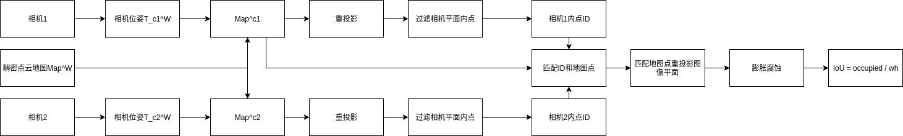

# CalculateImagesOverlapInHDMap

# 0. Usage

## 0.1.点云地图上Overlap计算基本验证`CalculateImagesOverlapInHDMap.cpp`

1. Download Vicon Room Datasets in EuRoC MAV Dataset which contains a HD pointcloud map
2. replace `ply_path` in `CalculateImagesOverlapInHDMap.cpp` with `PATH_TO_DATASET/V2_01_easy/mav0/pointcloud0/data.ply`
3. run

## 0.2.2D地图到点云地图上ICP基本验证`Registration2DGridMapWith3DMap.cpp`

1. Download Vicon Room Datasets in EuRoC MAV Dataset which contains a HD pointcloud map
2. replace `ply_path` with `PATH_TO_DATASET/V2_01_easy/mav0/pointcloud0/data.ply`
3. run

## 0.3.点云地图上Pinhole Camera Overlap计算基本验证`CalImagesOverlapInHDMap_Euroc.cpp`

Dev log: 
- https://www.notion.so/afc8e85f309e48f2a223bd2041ac697b

1. Download Vicon Room Datasets in EuRoC MAV Dataset which contains a HD pointcloud map
2. replace `path`
3. run: enter any key in image window for next random sample.

## 0.4.点云地图上Fisheye Camera Overlap计算基本验证`CalFisheyeOverlap_Euroc.cpp`

Dev log:
- https://www.notion.so/cfc7d3abd0e049d18cf60a93a18efd88
- 相互重投影取overlap小得作为二者得相似度：https://www.notion.so/8e4b35acb29b43c5b6c049977b317cdc#a76e67655bc34de9ad0f5a544663827b

1. Download Vicon Room Datasets in EuRoC MAV Dataset which contains a HD pointcloud map
2. change path in `config/fisheye.yaml`
3. run: enter any key in image window for next random sample.

# 1.目标
**输入/已有数据**
- 3D稠密点云地图
- 相机位姿
- 相机内参
**输出**
- 两张图像间的IoU

# 2. Pipeline

**思路:**
1. 将稠密点云地图依据位姿转换到相机坐标系下
2. 将所有点云重投影到某一位姿像素平面, 依据相机模型过滤出FOV内的点云(不超出长宽, z>0)
3. 进行ID匹配找到两个位姿下FOV重合部分点云
4. 将重合点云重投影到某一位姿像素平面
5. 形态学处理, 填补空洞
6. 计算有重投影的像素在图片的占比

# 3. 结果

- **实验设置**
    - 相机模型
        - 640x480
        - fx: 380, fy:380
        - cx: 320, cy:240

**3D地图上的效果:**

- 白色:原地图
- 红色: camera1
- 绿色: camera2
- 蓝色: overlap
    - Match Numbers:436838

**重投影到camera1上的图像效果: 膨胀→腐蚀**

- 白色: overlap点云重投影
    - Occupied Numbers:169602
    - Occupied Ratio:0.55209
- 黑色: 无重投影点

# **4. 改进空间**

**现存问题**

- 效率低
    - 需要遍历整个点云地图
- 地图点云密度小, 或者相机FOV覆盖点云数量少(靠近墙面等情况), 可能造成重投影空洞多

**改进空间**

- 依据相机模型进行粗滤
- 在地图坐标系下进行FOV点云采集
    - GPU并行raycast

